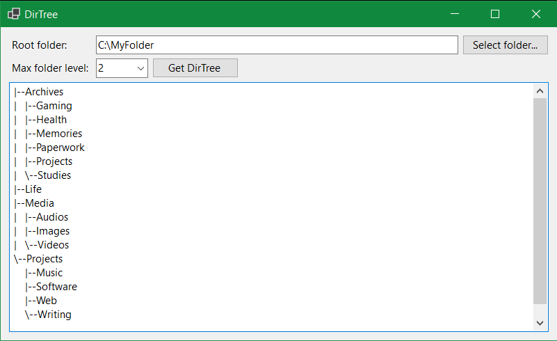

# DirTree

DirTree is a simple tool to get the directory tree structure of a folder (like the `tree` command).

  

## Prerequisites

- Windows OS
- .NET 8.0

## Quick Start

1. Select the root folder.
2. Set the maximum folder level.
3. Get DirTree :-)

## License

DirTree was created by C.D. Mendoza. This work is licensed under the GNU General Public License v3.0. See [LICENSE](LICENSE) for details.

## Release Notes

### 2025-06-25 ( v1.0.0 )

- Initial release.